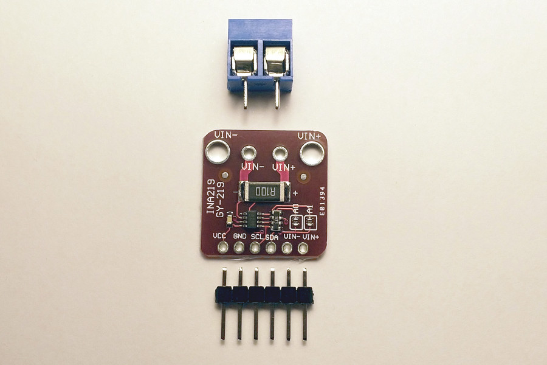

# Linux INA219 Library

This is a linux port for the arduino library [Adafruit's INA219](https://github.com/adafruit/Adafruit_INA219).

The idea is to bring a library able to work as driver at userspace using the kernel's posix functions. More info about linux i2c [here](https://www.kernel.org/doc/html/latest/i2c/dev-interface.html).
